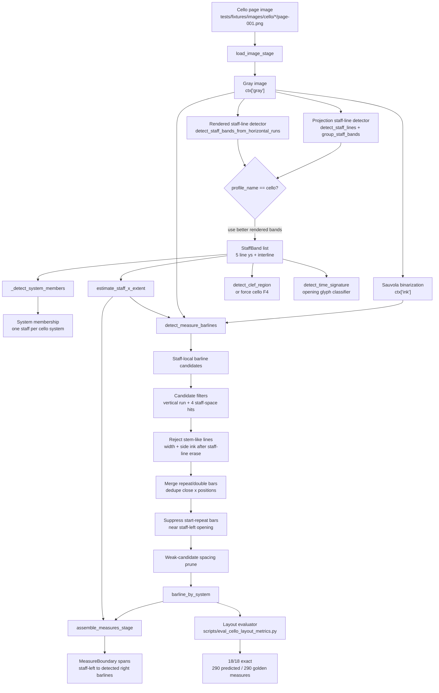
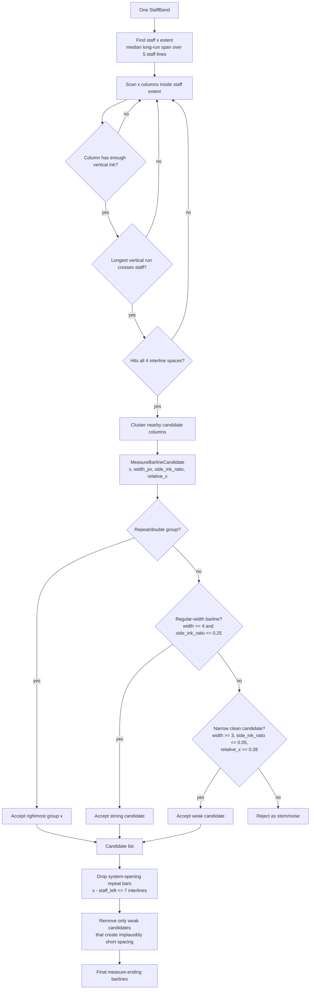
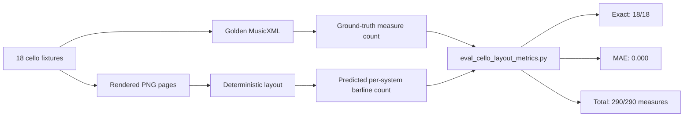

# Cello Deterministic Layout Reference

This document captures the parts of the cello pipeline that currently validate
well against the 18 rendered cello fixtures.  It is a reference point for
expanding the system without blurring proven deterministic stages with weaker
symbol-recognition stages.

Current validated strengths:

- Bass clef detection: 18/18 cello fixtures.
- Time signature detection: 18/18 cello fixtures.
- Staff/system/measure-count layout: 18/18 cello fixtures, 290/290 measures.

Not yet in the "works great" set:

- Notehead precision/recall.
- Stem, beam, accidental, rest, duration, voice, and full MusicXML semantic
  reconstruction.

## Deterministic Cello Layout Flow



## Barline Candidate Logic



## Validated Metrics



## Expansion Rules

When adding segmentation or learned detectors, keep this deterministic spine as
the baseline and comparison target.

1. New models may propose candidates, but candidates must still become explicit
   staff-relative hypotheses.
2. Staff, system, and measure geometry should remain inspectable before symbol
   semantics run.
3. Do not let noteheads, stems, beams, rests, or duration decoding overwrite
   the validated layout artifacts without a metric-backed improvement.
4. Every expanded stage should have an evaluator equivalent to
   `scripts/eval_cello_layout_metrics.py`.

Reference commands:

```bash
UV_CACHE_DIR=/tmp/uv-cache uv run python scripts/eval_cello_layout_metrics.py
UV_CACHE_DIR=/tmp/uv-cache uv run pytest -q tests/pipeline/test_cello_measure_barlines.py
UV_CACHE_DIR=/tmp/uv-cache uv run python scripts/eval_cello_stage_metrics.py
```
